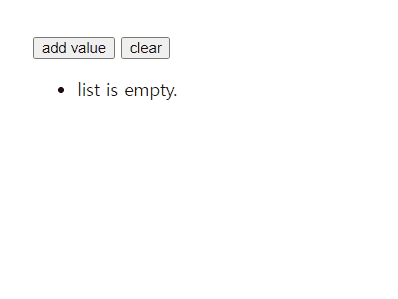
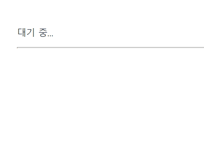

## 제어문

스벨트 템플릿 문법에서 흐름을 제어하는 방법은 if, each, await, key 이렇게 4가지가 있습니다. 이 템플릿들의 시작은 `{# ...}`이며, 끝은 `{/ ...}`로 표시합니다.

### \{#if ...\}

```svelte
{# if 표현식}
 <!-- ... -->
{:else if 표현식}
 <!-- ... -->
{:else}
 <!-- ... -->
{/ if}
```

사용 방법은 일반 if문과 동일합니다. 중괄호 안의 `#`이나 `:`, `/`을 주의해서 사용해주시면 됩니`다.

### \{#each ...\}

```svelte
{#each expression as name, index (key)}
  <!-- ... -->
{/each}
```

자바스크립트의 `Array.prototype.map()`과 사용법이 유사합니다. 첫 번째 인자로 배열 내부의 변수의 이름을, 두 번째 인자로 해당 인자의 index값을 받습니다. `(key)`는 Svelte가 요소의 변경을 감지하고 수정할 수 있도록 도와주는 키값입니다. React에서는 이러한 반복문 안에서 컴포넌트들에게 key값을 넘겨주는 것이 필수이지만, Svelte에서는 에러가 나지 않습니다.

```svelte
{#each items as {id, ...rest}}
  <li>
    <span>{id}</span>
    <MyComponent values={rest}/>
  </li>
{/each}
```

또한 이렇게 내부에서 구조 분해 할당이나 나머지 연산자를 사용할 수도 있습니다.

```svelte
{#each todos as todo}
  <p>{todo.text}</p>
{:else}
  <p>No tasks today!</p>
{/each}
```

값이 없을 경우 `{:else}` 블록을 이용하여 해당 내용을 렌더링 할 수도 있습니다.

```svelte
<script>
  let c = [];

  function addValue() {
    const copiedC = c.slice();
    copiedC.push(Math.ceil(Math.random()*10));
    c = copiedC;
  }

  function cleanAll() {
    c = [];
  }
</script>

<div>
  <button on:click={addValue}>add value</button>
  <button on:click={cleanAll}>clear</button>
  <ul>
  {#each c as item, index (index)}
    <li>{index} : {item}</li>
  {:else}
    <li>list is empty.</li>
  {/each}
  </ul>
</div>
```

간단한 반복문의 예제 코드입니다.



### \{#await ...\}

```svelte
<!-- 전체 제어문 -->
{#await expression}
  <!-- 보류 -->
{:then name}
  <!-- 성공 -->
{:catch name}
  <!-- 실패 -->
{/await}

```

```svelte
<!-- 보류 상태와 성공 상태를 한 문장으로 처리한 제어문 -->
{#await expression then name}
  <!-- 성공 시에만 -->
{/await}
```

```svelte
<!-- 보류 상태와 실패 상태를 한 문장으로 처리한 제어문 -->
{#await expression catch name}
  <!-- 실패 시에만 -->
{/await}
```

Svelte는 비동기 문법에 대한 제어문도 지원합니다. React에서는 동일한 기능을 구현하려면 useState로 새로운 상태 객체를 만들어야 했지만, Svelte에서는 문법적으로 지원합니다. `Promise`는 `pending(보류)`, `fulfilled(성공)`, `rejected(실패)` 이렇게 3가지 상태를 가질 수 있습니다.
보류와 성공 상태를 하나로 묶거나, 보류와 실패 상태를 하나로 묶어 처리할 수도 있습니다. 이 제어문은 SSR 모드에서도 사용할 수 있는데, 이때 보류 상태만 서버에서 렌더링됩니다.

```svelte
<script>
  let resolve_promise = resolvePromise();
  let reject_promise = rejectPromise();

  async function resolvePromise() {
    return Promise.resolve('Hello svelte!');
  }

  async function rejectPromise() {
    return Promise.reject({message: "내부 에러"});
  }
</script>

<div>
  {#await resolve_promise}
    <p>대기 중...</p>
  {:then value}
    <p>값: {value}</p>
  {:catch error}
    <p>처리 실패: {error.message}</p>
  {/await}
  <hr>
  {#await reject_promise catch error}
    <p>처리 실패: {error.message}</p>
  {/await}
</div>
```

간단한 예시코드입니다. resolve만 하는 Promise 함수(resolvePromise)와 reject만 하는 Promise 함수(rejectPromise)를 렌더링하는 코드입니다.



### \{#key ...\}

```svelte
{#key expression}
  <!-- ... -->
{/key}
```

키 블록은 표현식의 값이 변경될 때 내용을 지우고 재생성합니다. 값이 변경될 때 요소의 애니메이션을 재생하고 싶을 때 유용합니다.

## Reference

[스벨트 공식문서](https://svelte.dev/docs#component-format)

[자바스크립트 Promise 문서](https://developer.mozilla.org/en-US/docs/Web/JavaScript/Reference/Global_Objects/Promise)
