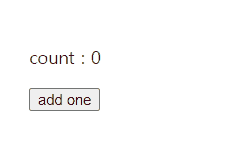
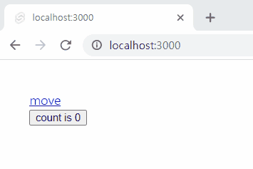

## 변수

### 기본적인 선언 및 사용

```svelte {linenos=inline,hl_lines=[2,6]}
<script>
  let count = 0;
</script>

<div>
  <p>count : {count}</p>
</div>
```

변수의 선언은 2번째 줄과 같이, `<script>` 태그 안에서 일반 자바스크립트 변수 선언하듯이 선언합니다. 사용하는 방법은 10번째 줄관 같이 `{변수명}`과 같이 사용합니다.

### export를 사용한 변수

```svelte {linenos=inline,hl_lines=[2]}
<script>
	export let foo;
	export const bar = 'readonly';

	// Values that are passed in as props
	// are immediately available
	console.log({ foo });
</script>
```

만약 변수 선언할 때 `export`를 붙였다면, 해당 변수는 이 컴포넌트를 사용한 곳에서 읽을 수 있게 됩니다. 자바스크립트 모듈에서 export를 붙인 것과 동일합니다.

만약 변수 선언 시 `let`이 아닌 `const`를 사용하였다면, 이 변수는 읽기 전용이 됩니다.

### 반응형 변수

```svelte {linenos=inline,hl_lines=["4-6", 11]}
<script>
  let count = 0;

  function addOne() {
    count = count + 1;
  }
</script>

<div>
  <p>count : {count}</p>
  <button on:click={addOne}>add one</button>
</div>
```

스벨트는 리액트와 다르게 useState와 같은 메서드를 이용하여 선언을 할 필요가 없습니다. 그냥 일반 변수처럼 선언한 후, 핸들링하는 함수를 만들고 사용하기만 하면 됩니다. 4-6번째 줄과 같이 `<script>` 태그 안에 1을 더해주는 함수 addOne()을 만들어 주고 11번째 줄의 `<button>` 태그에 onclick 이벤트로 달아주면 됩니다.



### `$:` 구문을 이용하여 반응형 업데이트

```svelte {linenos=inline,hl_lines=[9, 17]}
<script>
  let a = 0;
  let b = 0;

  function add(a, b) {
    return a + b;
  }

  $: sum = add(a, b);
</script>

<div>
  <input type="number" bind:value={a} />
  +
  <input type="number" bind:value={b} />
  =
  <span>{sum}</span>
</div>
```

위 예시는 `a`와 `b`를 더하는 코드입니다. input으로 `a`값과 `b`값을 받아서 값을 저장한 후 더해서 `sum`으로 보여줍니다. `bind:value`는 일단 모르셔도 됩니다. input의 value를 뒤의 변수와 연결시켜주는 역할을 한다는 정도만 이해하시면 됩니다.여기서 `$:` 다음에 나오는 변수들은 스벨트에서 자동으로 관찰(Observe)하고 있다, 변경이 감지되면 즉각적으로 뒤에 있는 코드 `add(a, b)`를 실행하게 됩니다.


```svelte {linenos=inline,linenostart=5}
  function add(b) {
    return a + b;
  }

  $: sum = add(b);
```

만약 코드 중 일부가 위와 같이 바뀌면 어떻게 될까요? `$:` 뒤에 변수가 `b`만 존재하므로 `a`의 값이 변경될 때는 `sum`이 업데이트되지 않습니다. 오로지 `b`의 값이 변경될 때만 `sum`값이 업데이트되게 됩니다.

그럼 `$:`를 안 쓰면 어떻게 될까요?

```svelte {linenos=inline}
<script>
  let a = 0;
  let b = 0;
</script>

<div>
  <input type="number" bind:value={a} />
  +
  <input type="number" bind:value={b} />
  =
  <span>{a + b}</span>
</div>

```

`$:` 구문을 사용했을 때와 크게 다르지 않습니다. `$:` 구문을 사용하면 별도의 변수로 선언할 수 있고, 원하는 변수가 변경됐을 때만 업데이트 하게 만들 수 있다는 장점이 있을 것으로 보입니다.

### `$` 접두사를 이용한 svelte/store 사용

svelte/store는 다른 컴포넌트에서 해당 변수를 반응형을 유지하면서 쉽게 접근할 수 있게 만들어주는 svlete 모듈입니다.

```javascript {linenos=inline}
/* count.js */
import { writable } from "svelte/store";

export const count = writable(0);
```

```svelte {linenos=inline,hl_lines=[3,6,14]}
<!-- index.svelte  -->
<script>
  import {count} from './count.js'

  function addOne() {
    $count = $count + 1;
  }
</script>

<div>
  <a href="/test">move</a>
  <br />

  <button on:click={addOne}>count is {$count}</button>
</div>
```

```svelte {linenos=inline,hl_lines=[3,10]}
<!-- test.svelte -->
<script>
  import {count} from './count.js'
</script>

<div>
  <a href="/">back</a>
  <br />

  <span>count is {$count}</span>
</div>
```

위의 예제 코드에서는 `count.js`에서 변수를 선언한 후, `index.svelte`와 `test.svelte`에서 사용하는 예시입니다. store된 변수에 접근할 때는 예시처럼 변수명 앞에 `$` 접두사를 붙여야 합니다.



## References

[스벨트 공식문서](https://svelte.dev/docs#component-format-script)
