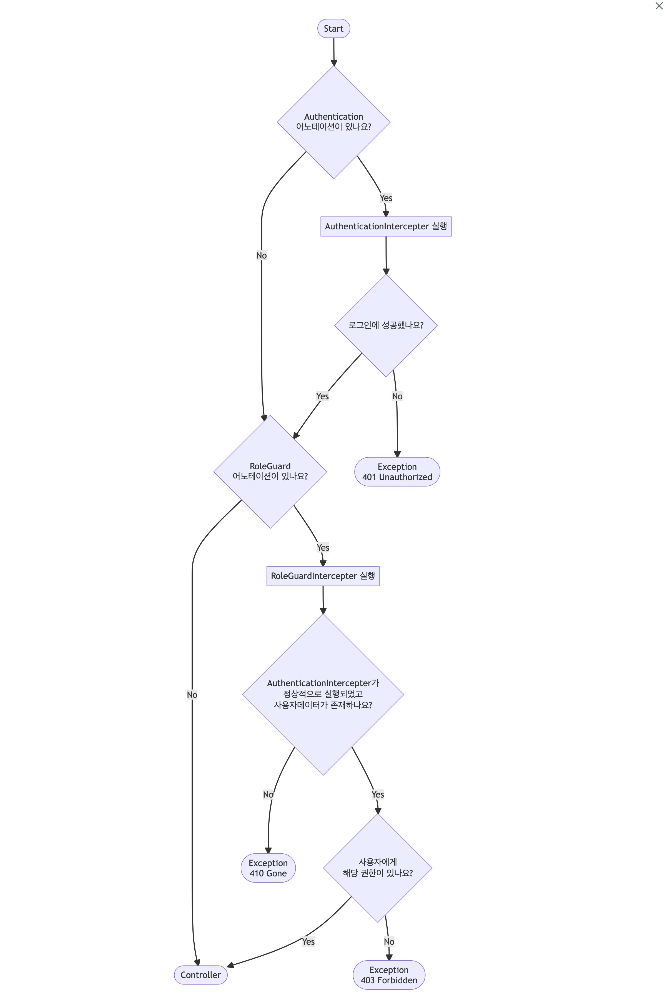

# 서론

> 모든 코드는 **Kotlin** 으로 작성되었습니다.

파이어베이스는 인증, 데이터베이스, 메시징 등을 제공하는 구글의 서비스 중 하나입니다. 무형문화연구원에서 인증에 이 파이어베이스를 사용하기로 했고, 프론트엔드(리액트 기반)에서는 이 인증 전략을 사용하는 것이 매우 수월하였습니다. 하지만 백엔드에서는 그렇게 쉬운 작업이 아니라는 걸 깨닫는 데에는 그리 오래 걸리지 않았습니다. 처음에는 Spring Security와 통합하여 사용하려 했으나, 통합하는데 어려움이 컸고 역할 체크가 필요한 작업에도 마찬가지로 매우 어려운 일이었습니다. 필터에서 동작하는 Spring Security대신 성능에 조금 손해가 있더라도 원하는 기능을 쉽게 구현할 수 있는 인터셉터를 사용하여 인증을 구현하였습니다.

# 흐름도

<!-- mermaid 원본 코드 : https://github.com/yunu7067/yunu7067.github.io/discussions/20 -->



# 구현

## 어노테이션

어노테이션으로는 `@Authentication`과 `@RoleGuard`를 구현하였습니다. `@Authentication`은 로그인만 체크를 하는 어노테이션이며, `@RoleGuard`는 로그인 된 사용자의 역할을 필터링하는 어노테이션입니다. `@RoleGuard`은 무조건 `@Authentication`이 있어야 하며, `@Authentication`뒤에 작성하여야 합니다.

### @Authentication

`@Authentication` 어노테이션은 매개변수 없이 작성만 하도록 구현하였습니다. 이하는 클래스 위에 붙은 어노테이션들에 대한 설명입니다.

`@Target`은 이 어노테이션을 사용할 수 있는 타깃을 지정합니다. `AnnotationTarget.FUNCTION`이라 했으므로 이 어노테이션은 함수(Function)에서만 사용 가능합니다. 클래스나 매개변수 등에서는 사용이 불가능합니다. ([AnnotationTarget](https://kotlinlang.org/api/latest/jvm/stdlib/kotlin.annotation/-annotation-target/) 문서 참조)

`@Retention`은 이 어노테이션이 컴파일 클래스에도 유지되는지, 런타임 시 리플렉션으로 표현되는지 관한 것으로 자바에서는 `SOURCE|CLASS|RUNTIME` 이렇게 세 가지가 있습니다. `SOURCE`로 설정할 경우 컴파일 레벨에서 이 어노테이션은 버려지고, `CLASS`로 설정할 경우 유지는 되지만 JVM에서 실행될 때 포함되지는 않습니다. 마지막으로 `RUNTIME`으로 설정할 경우 런타임까지 코드가 살아있으며 실행됩니다. 코틀린에서는 이름이 조금 다른데, `CLASS`가 `BINARY`로 바뀌어 `SOURCE|BINARY|RUNTIME`로 사용합니다. 동작은 동일합니다. ([AnnotationRetention](https://kotlinlang.org/api/latest/jvm/stdlib/kotlin.annotation/-annotation-retention/) 문서 참조)

`@MustBeDocumented`은 public API 문서에 포함되는지 여부를 나타냅니다.

```kotlin
/* Authentication.kt */

@Target(AnnotationTarget.FUNCTION)
@Retention(AnnotationRetention.RUNTIME)
@MustBeDocumented
annotation class Authentication
```

### @RoleGuard

`@RoleGuard` 어노테이션에서는 에서는 여러 역할을 체크할 수 있도록 배열 형식의 매개변수를 추가하였습니다. 클래스 위의 어노테이션은 위와 동일합니다.

```kotlin
/* RoleGuard.kt */

@Target(AnnotationTarget.FUNCTION)
@Retention(AnnotationRetention.RUNTIME)
@MustBeDocumented
annotation class RoleGuard(
    val role: Array<String>
)
```

## 인터셉터

실질적인 인터셉터 동작은 이 인터셉터 클래스에 구현됩니다. 모두 스프링 Bean 컨테이너에 등록되어야 하므로 `@Component`를 붙여줍니다.

### FirebaseAuthInterceptor

```kotlin
/* FirebaseAuthInterceptor.kt */

@Component
class FirebaseAuthInterceptor(private val firebaseService: FirebaseService) : HandlerInterceptor {

    override fun preHandle(request: HttpServletRequest, response: HttpServletResponse, handler: Any): Boolean {
        if (handler is HandlerMethod) {
            handler.getMethodAnnotation(Authentication::class.java)?.let {
                val token = request.getHeader("Authentication")
                    ?: throw ResponseStatusException(HttpStatus.UNAUTHORIZED, "로그인이 필요한 서비스입니다.")
                val uid = firebaseService.getUid(token)
                request.setAttribute("firebase_uid", uid)
            }
            return true

        } else if (handler is ResourceHttpRequestHandler) {
            return true
        } else {
            throw ResponseStatusException(HttpStatus.INTERNAL_SERVER_ERROR, "서버에 오류가 발생했습니다. 관리자에게 문의해주세요.")
        }
    }
}
```

### RoleGuardInterceptor

```kotlin
/* RoleGuardInterceptor.kt */

@Component
class RoleGuardInterceptor(private val userRepository: UserRepository) : HandlerInterceptor {

    override fun preHandle(request: HttpServletRequest, response: HttpServletResponse, handler: Any): Boolean {
        if (handler is HandlerMethod) {
            handler.getMethodAnnotation(RoleGuard::class.java)?.let { roleGuard ->
                val uid: String = request.getAttribute("firebase_uid") as String
                val user: User = userRepository.findByUid(uid)
                    ?: throw ResponseStatusException(HttpStatus.GONE, "사용자를 찾을 수 없습니다.")

                return if (user.hasRole(roleGuard.role)) true
                else throw ResponseStatusException(HttpStatus.FORBIDDEN, "권한이 없습니다.")
            }
        } else if (handler is ResourceHttpRequestHandler) {
            return true
        } else {
            throw ResponseStatusException(HttpStatus.INTERNAL_SERVER_ERROR, "서버에 오류가 발생했습니다.")
        }

        return true
    }
}
```

`getMethodAnnotation` 메서드로 `@RoleGuard` 어노테이션이 존재하는 지 확인한 후, 이후 람다식을 실행합니다. 먼저 이전 `FirebaseAuthInterceptor`가 정상적으로 실행되어 유저를 찾았다면 request의 속성에 firebase_uid라는 이름으로 값이 담겨있습니다. 만약 이 값이 없거나 있지만 사용자를 찾ㅇ르 수 없는 경우 `ResponseStatusException`를 사용하여 `410 Gone` 상태코드를 반환합니다. 사용자가 있었으면 역할(role) 체크를 진행합니다. 위에서 말한 것 처럼 역할은 배열로 들어옵니다. 이 배열에 해당하는 역할이 존재하는지 체크한 후, 일치하는 역할이 없는 경우 `401 Forbidden` 상태코드를 반환합니다. 만약 존재한다면 정상적으로 Controller를 실행합니다.

## 인터셉터 Configuration 구현

```kotlin
/* InterceptorConfig.kt */

@Configuration
class InterceptorConfig(
    private val firebaseAuthInterceptor: FirebaseAuthInterceptor,
    private val roleGuardInterceptor: RoleGuardInterceptor,
) : WebMvcConfigurer {
    override fun addInterceptors(registry: InterceptorRegistry) {
        registry.addInterceptor(firebaseAuthInterceptor)
        registry.addInterceptor(roleGuardInterceptor)
    }
}
```

`FirebaseAuthInterceptor` 인터셉터와 `RoleGuardInterceptor` 인터셉터를 등록시켜줍니다.

## 실제 사용

```kotlin
/* ScheduleApiController.kt */

@RestController
@RequestMapping(value = ["/schedule"])
class ScheduleApiController(
    private val scheduleService: ScheduleService,
    private val calendarService: CalendarService,
) {
    private val logger: Logger = LoggerFactory.getLogger(this::class.java)

    @GetMapping("")
    fun readSchedules(): List<Schedule> {
        return scheduleService.getAll()
    }


    @GetMapping("/{schedule_id}")
    fun readSchedule(
        @PathVariable("schedule_id") scheduleId: Long,
    ): Schedule {
        return scheduleService.getScheduleById(scheduleId)
    }


    @Authentication
    @RoleGuard(["ADMINISTRATOR", "RESEARCHER"])
    @PostMapping("")
    fun createSchedule(@RequestBody dto: ScheduleDto.ScheduleCreateDto): Schedule {
        return scheduleService.create(dto)
    }


    @Authentication
    @RoleGuard(["ADMINISTRATOR", "RESEARCHER"])
    @PatchMapping("/{schedule_id}")
    fun updateSchedule(
        @PathVariable("schedule_id") scheduleId: Long,
        @RequestAttribute("firebase_uid") uid: String,
        @RequestBody dto: ScheduleDto.ScheduleUpdateDto,
    ): Schedule {
        return scheduleService.updateById(scheduleId, dto)
    }

    /* 후략 */

}
```

```kotlin
@Authentication
@RoleGuard(["ADMINISTRATOR", "RESEARCHER"])
```

인증 체크와 역할 체크가 필요한 url에 위와 같은 어노테이션을 작성해주었습니다. 위의 경우 **로그인이 필요**하고 **관리자와 연구원만 접근이 가능**하게 됩니다.

# 참고문헌

- [Annotations | Kotlin](https://kotlinlang.org/docs/annotations.html)
- [HTTP 상태 코드 - HTTP | MDN](https://developer.mozilla.org/ko/docs/Web/HTTP/Status)
