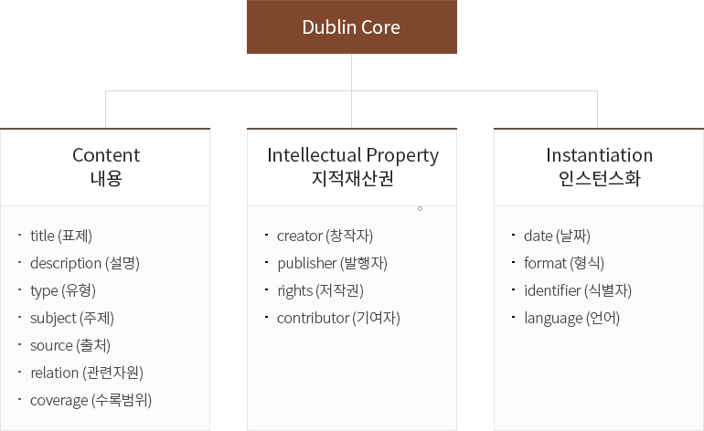

- [DCMI Terms](https://www.dublincore.org/specifications/dublin-core/dcmi-terms/)
- [문화체육관광부 - 국립중앙도서관 더블린 코어 소개](https://librarian.nl.go.kr/LI/contents/L10201000000.do)

이하 내용은 DCIM 공식 문서 및 문화체육관광부 국립중앙도서관 더블린 코어 페이지에서 발췌한 내용입니다.

---

## Attributes

### 필수 속성

- 이름(Name) - 기계가 처리할 수 있는 용어에 할당된 고유한 이름
- URI - 해당 속성에 대한 웹상에서 적용 가능한 고유 식별자
- 레이블(Label) - 용어의 다른 형태의 이름. 사람이 읽고 이해하기 쉬운 이름으로, 기계 가독을 위한 이름(Name) 특성과 구분
- 정의(Definition) - 용어의 개념과 특성에 대한 설명
- 용어유형(Type of Term) - 용어의 유형으로 DCMI에서 정의된 어휘만 사용

### 부가적인 속성

- 주석 (Comment) - 해당 용어의 사용에 관한 부가 정보
- 참조 (See) - 해당 속성에 관한 문서
- 참조정보 (References) - ‘정의’ 나 ‘참조’ 항목에서 참조된 자원
- 상위 속성 (Refines) - 해당 용어가 속한 상위 속성
- 상위 클래스 (Broader Than) - 해당 용어가 속한 상위클래스

  - DCMI 클래스는 `<Agent>`, `<AgentClass>`, `<BibliographicResource>` 등 22개로 구성
    (http://www.dublincore.org/documents/dcmi-terms/#section-6 를 참고하세요.)

- 하위 클래스 (Narrower Than) - 해당 용어에 속한 하위클래스
- 사용 도메인 (Has Domain) - 해당 용어가 사용되는 상위 도메인(인스턴스)
- 값 영역 (Has Range) - 해당 용어의 값을 입력하는데 사용 가능한 형식 또는 범위
- 해당 어휘집 (Member Of) - 해당 용어가 정의된 어휘 인코딩 체계
- 해당 인스턴스 (Instance Of) - 해당 용어가 속한 인스턴스
- 버전 (Version) - 해당 용어의 이력
- 유사 속성 (Equivalent Property) - 해당 용어와 유사하게 사용되는 용어

## Properties

abstract, accessRights, accrualMethod, accrualPeriodicity, accrualPolicy, alternative, audience, available, bibliographicCitation, conformsTo, **_contributor_**, **_coverage_**, created, **_creator_**, **_date_**, dateAccepted, dateCopyrighted, dateSubmitted, **_description_**, educationLevel, extent, **_format_**, hasFormat, hasPart, hasVersion, **_identifier_**, instructionalMethod, isFormatOf, isPartOf, isReferencedBy, isReplacedBy, isRequiredBy, issued, isVersionOf, **_language_**, license, mediator, medium, modified, provenance, **_publisher_**, references, **_relation_**, replaces, requires, **_rights_**, rightsHolder, **_source_**, spatial, **_subject_**, tableOfContents, temporal, **_title_**, **_type_**, valid

굵은 글씨는 DCMES(Dublin Core™ Metadata Element Set)의 용어. 총 15개.

### 통제 어휘 (Controlled Vocabulary)

| 요소                    | 상세구문                                                                                                                                                                  | 인코딩 스킴                                   |
| :---------------------- | :------------------------------------------------------------------------------------------------------------------------------------------------------------------------ | :-------------------------------------------- |
| Title (주제)         | alternative                                                                                                                                                               |                                               |
| creator (제작자)     |                                                                                                                                                                           |                                               |
| subject (주제)       |                                                                                                                                                                           | DDC, LCC, LCSH, NLM, UDC, MESH                |
| description (설명)   | abstract, tableOfContents, provenance                                                                                                                                     |                                               |
| publisher (출판사)   |                                                                                                                                                                           |                                               |
| contributor (기여자) |                                                                                                                                                                           |                                               |
| date (날짜)          | created, valid, issued, modified, dateCopyrighted, dateSubmitted, available, dateAccepted                                                                                 | W3CDTF                                        |
| type (유형)          |                                                                                                                                                                           | DCMIType                                      |
| format (형식)        | extent, medium                                                                                                                                                            | IMT                                           |
| identifier (식별자)  | bibliographicCitation                                                                                                                                                     | URI                                           |
| source (출처)        | URI                                                                                                                                                                       |
| language (언어)      |                                                                                                                                                                           | RFC4646, ISO639-2, ISO639-3, RFC1766, RFC3066 |
| relation (관계)      | isVersionOf, isReferencedBy, isReplacedBy, isRequiredBy, isPartOf, inReferencedBy, isFormatOf, conformsTo, hasVersion, replaces, requires, hasPart, references, hasFormat |                                               |
| coverage (범위)      | spatial, temporal                                                                                                                                                         | Box, Point, Period, ISO3166, TGN, W3DCTF      |
| rights (저작권)      | accessRights, rightsHolder, license                                                                                                                                       |                                               |

### Dublin Core™ Metadata Element Set

초기의 더블린 코어 요소. 15개의 요소로 구성되어 있고 모든 요소가 평면적이기 때문에 계층성이 없고, 선택적(Optional)이며 반복 가능하고 어떤 순서로든 사용할 수 있다.
해당 속성(Property)는 `/elements/1.1/` 네임스페이스에 기술되어 있다.

- Content (내용)

  - [Title (표제)](https://www.dublincore.org/specifications/dublin-core/dcmi-terms/elements11/title/) :
    자원에 부여된 이름
  - [Description (설명)](https://www.dublincore.org/specifications/dublin-core/dcmi-terms/elements11/description/) :
    자원의 내용물에 대한 설명
  - [Type (유형)](https://www.dublincore.org/specifications/dublin-core/dcmi-terms/elements11/type/) : 자원의 내용물의 성격>이나 장르
  - [Subject (주제)](https://www.dublincore.org/specifications/dublin-core/dcmi-terms/elements11/subject/) :
    자원의 주제. 통상적으로 주제는 핵심어나 핵심어구, 분류기호 등이 포함되며, 통제 어휘로 사용할 것을 권고함
  - [Source (출처)](https://www.dublincore.org/specifications/dublin-core/dcmi-terms/elements11/source/) :
    기술 대상 자원이 파생된 (원) 자원
  - [Relation (관계)](https://www.dublincore.org/specifications/dublin-core/dcmi-terms/elements11/relation/) :
    관련 자원에 대한 참조
  - [Coverage (범위)](https://www.dublincore.org/specifications/dublin-core/dcmi-terms/elements11/coverage/) :
    자원의 내용물의 수량이나 범위

- Intellectual Property (지적재산권)

  - [Creator (제작자)](https://www.dublincore.org/specifications/dublin-core/dcmi-terms/elements11/creator/) :
    자원의 내용물을 만드는 데 일차적인 책임을 가지는 개체(엔티티)
  - [Publisher (발행처)](https://www.dublincore.org/specifications/dublin-core/dcmi-terms/elements11/publisher/) :
    자원 접근(이용)에 책임이 있는 개체. 발행처에는 개인, 기관, 서비스 등이 포함됨
  - [Rights (이용조건)](https://www.dublincore.org/specifications/dublin-core/dcmi-terms/elements11/rights/) :
    자원의 저작권 정보. 통상적으로 저작권 정보에는 지적 재산권과 같이 자원과 관련된 재산권 내용을 기술함
  - [Contributor (기여자)](https://www.dublincore.org/specifications/dublin-core/dcmi-terms/elements11/contributor/) : 자원>에 기여한 책임이 있는 개체. 사람, 기관, 서비스 등이 해당됨

- Instantiation (인스턴스화)
  - [Date (발행일자)](https://www.dublincore.org/specifications/dublin-core/dcmi-terms/elements11/date/) :
    자원이 현재의 형태로써 이용 가능하게 된 날짜
  - [Format (형식)](https://www.dublincore.org/specifications/dublin-core/dcmi-terms/elements11/format/) :
    자원의 파일 형식이나 물리적 매체. 경우에 따라 크기나 재생시간을 포함할 수 있으며, MIME과 같은 통제어휘의 사용을 권고함
  - [Identifier (식별자)](https://www.dublincore.org/specifications/dublin-core/dcmi-terms/elements11/identifier/) :
    특정 환경 내에서의 자원의 참조 정보. 공식적인 식별 체계를 준용한 문자열을 사용할 것을 권고함
  - [Language (언어)](https://www.dublincore.org/specifications/dublin-core/dcmi-terms/elements11/language/) :
    자원의 지적 내용의 언어

### 용어

작성중
